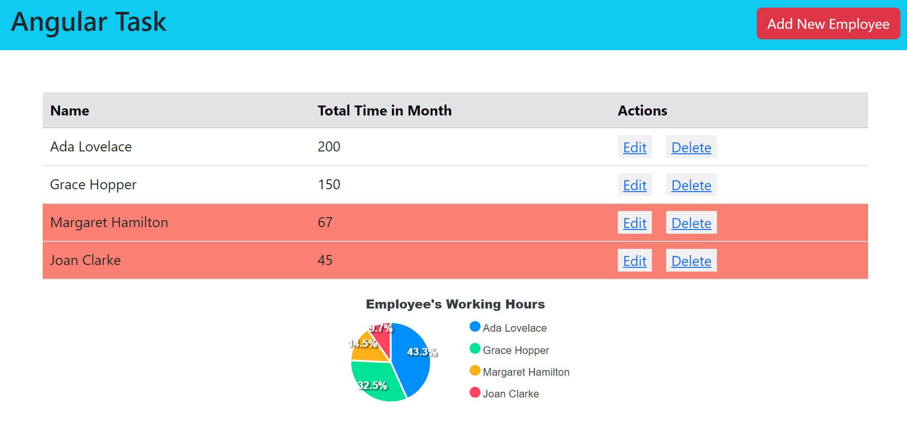

# Angular Project

## To Run the Project 


#### 1- Install Packages at first
```
npm install
```

#### 2- Run these important commands

```
json-server --watch db.json
```

```
ng serve --open
```

#### 3- Add Employees and Edit in hours and Names as You like

#### 4- If there's a delay in APEX package which draw Pie-chart just refresh the page

#### 5- Try to add, Delete and Edit in Hours to see auto dynamic changes in Highlighting and Sorting

